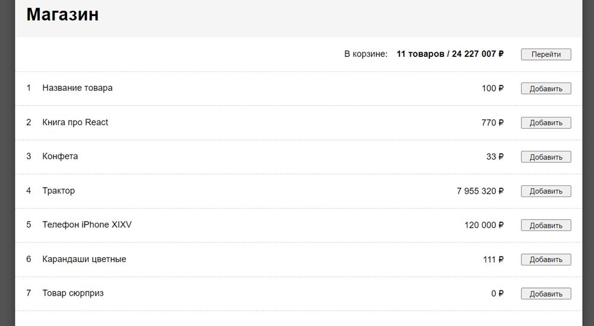
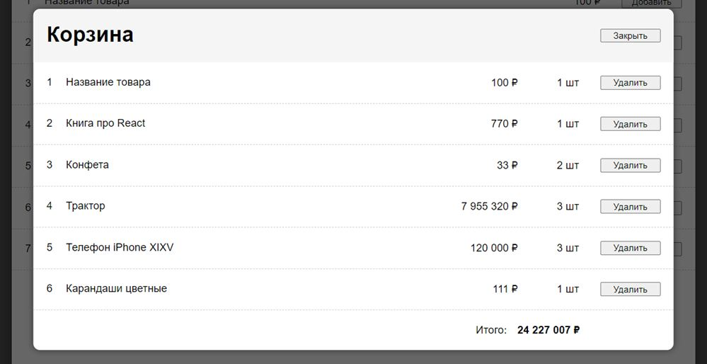

# Задание 02

Реализовать каталог товаров и корзину с выбранным товаром.

## Задача 1

Вместо кнопки удаления записи теперь кнопка добавления товара в корзину. Сколько раз нажали, столько количества товара ушло в корзину. 

## Задача 2

В шапке общее количество уникального товара и сумма с учётом всего количества. И кнопка для открытия модалки корзины поверх текущей страницы. 

## Задача 3

В модалке список добавленного в корзину товара с количеством в каждой записи. В корзине у товара вместо кнопки добавления, кнопка удаления из корзины. Без редактирования количества. Внизу списка сумма. Кнопка закрытия в шапке модалки.

