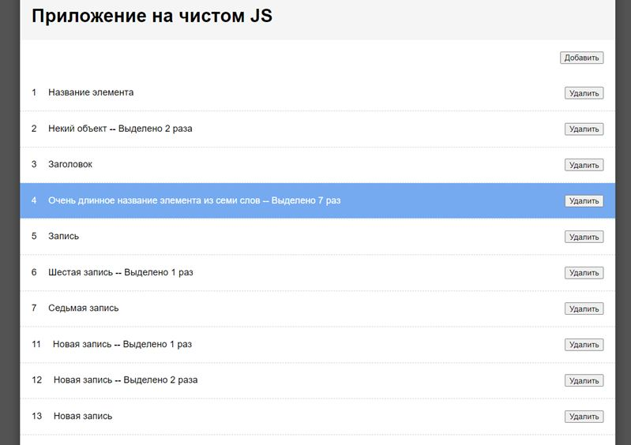

# Задание 01

## [Demo](https://devmikealex.github.io/react-webinar-3/dist/)

### Задача 1
Доработать выделение записей, чтобы при выделении сбрасывалось выделения у других записей. Клик по выделенной записи тоже отменяет выделение. 

### Задача 2
Доработать создание новой записи. Реализуйте генератор уникальных чисел в рамках сессии. Генерировать огромные числа не надо, просто обеспечьте неповторимость кодов.

### Задача 3
Вывести количество совершенных выделений для каждого пункта фразой “Выделяли N раз”. По умолчанию у всех ноль. Фразу с нулём выводить не надо.

